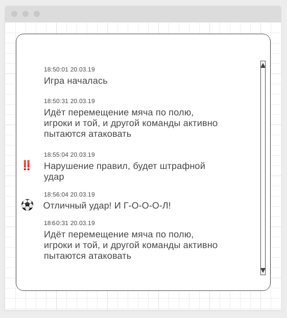

# Домашнее задание к занятию "8. EventSource, Websockets"

## Backend

Ссылка на git-hub репозиторий (backend): https://github.com/darknessdizi/JavaScript_21_Websockets_backend_task3.git

Ссылка сервера на render: https://dashboard.render.com/web/srv-cnoa1ofsc6pc738ho0q0/deploys/dep-cnoa1onsc6pc738ho0sg

---

## Fronted

Ссылка на git-hub репозиторий (fronted): https://github.com/darknessdizi/JavaScript_21_Websockets_fronted_task3.git

Ссылка на страницу: https://darknessdizi.github.io/JavaScript_21_Websockets_fronted_task3/

Правила сдачи задания:

1. **Важно**: в рамках этого ДЗ можно использовать любой менеджер пакетов
2. Всё должно собираться через Webpack (включая картинки и стили) и выкладываться на Github Pages через Appveyor
3. В README.md должен быть размещён бейджик сборки и ссылка на Github Pages
4. В качестве результата присылайте проверяющему ссылки на ваши GitHub-проекты
5. Авто-тесты писать не требуется
6. Серверная часть должна быть выложена на [Render](https://render.com/). Посмотрите [инструкцию](https://github.com/netology-code/ahj-homeworks/tree/video/docs/render#readme) или [документацию](https://render.com/docs/deploy-node-express-app), как развертывать серверную часть на Render.

---

## Онлайн репортаж* (задача со звёздочкой)

Важно: эта задача не является обязательной. Её (не)выполнение не влияет на получение зачёта по ДЗ.

### Легенда

Вы делаете портал спортивных трансляций, на которых пользователи могут видеть текстовую трансляцию матча. Поскольку вам нужно получать обновления с сервера, но не отправлять их обратно, достаточно использовать SSE для получения данных.

### Описание

Необходимо реализовать серверную часть и клиентскую, позволяющие по SSE получать данные с прямого репортажа о футбольном событии

#### Серверная часть

На серверной части генерируйте с произвольным интервалом несколько типов событий:
1. Комментарий об игровом действии, например: "Идёт перемещение мяча по полю, игроки и той, и другой команды активно пытаются атаковать" (тип - `action`)
1. Штрафной удар, например: "Нарушение правил, будет штрафной удар" (тип - `freekick`)
1. Гол, например: "Отличный удар! И Г-О-Л!" (тип - `goal`)

Генерируйте события в случайном порядке с различной долей вероятности:
1. Вероятность первого события - 50%
1. Вероятность второго события - 40%
1. Вероятность третьего события - 10%

Игра должна стартовать при старте сервера (генерация событий). Максимум сгенерированных событий - 50.

Обратите внимание, все события должны кэшироваться, так, чтобы игрок, подключившийся не с самого начала матча,получал всю предыдущую историю игры.

#### Клиентская часть

Клиентская часть должна выглядеть следующим образом:

Обратите внимание, для событий с типом `freekick` и `goal` сбоку устанавливаются иконки.

Реализуйте виджет в виде отдельного класса, который сам генерирует для сбея разметку и которому в качестве параметра конструктора передаётся URL для подключения.
